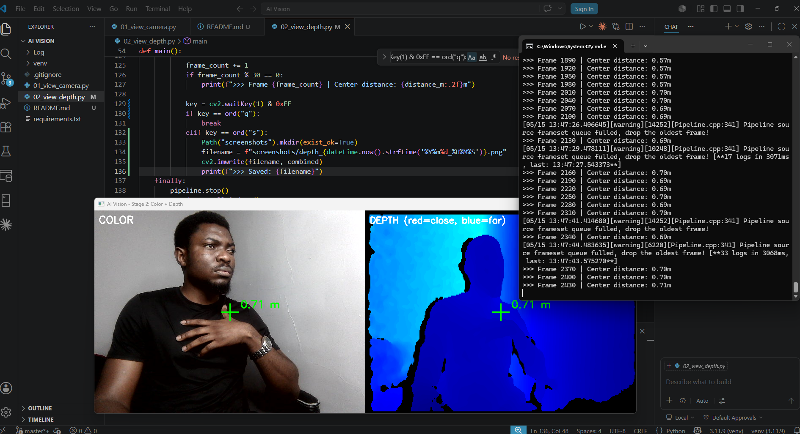

# AI Vision

# AI Vision

Real-time depth-camera vision pipeline in Python. Streams color and depth from an Orbbec DaBai DCW2, renders them side-by-side with a colorized depth heat map, and measures the distance to anything in front of the camera in real time.

Built and tested on a Windows PC. The same code runs on any system that supports the Orbbec SDK — including the NVIDIA Jetson Orin NX.

## Current Stage: 2 of 6 — Color + Depth with Live Distance ✅

Live 640×480 color stream and 640×400 depth stream from an Orbbec DaBai DCW2,
rendered side-by-side with a colorized depth heat map and a crosshair measuring
the distance to the center of the frame in real time.



The image on the left is normal color. The image on the right is the same scene
rendered as depth — each pixel's color represents its distance from the camera
(red/yellow = close, blue = far, black = no depth data). The crosshair shows the
camera physically measuring how far the subject is from the lens, in meters,
with millimeter precision.

## Hardware

- **Camera:** Orbbec DaBai DCW2 (USB 2.0, OpenNI protocol)
- **Host:** Windows 11, Python 3.11
- **Target:** NVIDIA Jetson Orin NX (future)

## Stack

- `pyorbbecsdk-community==1.4.2` — Python bindings for Orbbec SDK
- `opencv-python==4.13.0.92` — frame decoding and display
- `numpy<2.0` — pinned for pyorbbecsdk compatibility

## Run

```bash
python -m venv venv
venv\Scripts\activate
pip install -r requirements.txt
python 01_view_camera.py
```

Press `q` in the window to quit.

## Roadmap

- [x] **Stage 1:** Live color stream
- [x] **Stage 2:** Depth stream + colorized depth visualization + live distance measurement
- [ ] **Stage 3:** Real-time object detection (YOLOv8)
- [ ] **Stage 4:** Speech-to-text (Whisper)
- [ ] **Stage 5:** Claude API integration ("what do you see?")
- [ ] **Stage 6:** Port to Jetson Orin NX → IRIS

## Author

Edouard AGBOR — Founder, [GritGateway](https://gritgateway.com) · M.S. Applied Human-Centered AI, Syracuse University iSchool