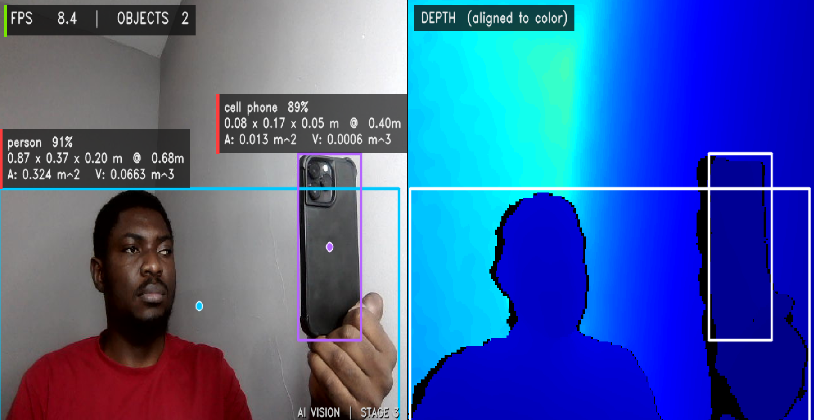
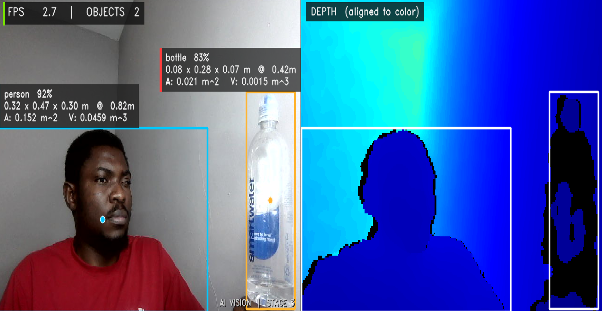

# AI 3D Vision

Real-time depth-camera vision pipeline in Python. Streams color and depth from an Orbbec DaBai DCW2, detects objects with YOLOv8, fuses each detection with aligned depth to compute real-world 3D coordinates, physical dimensions, front-face area, and visible bounding-box volume — all in real time on a Windows PC.

Built and tested on Windows 11. The same code runs on any system that supports the Orbbec SDK, including the NVIDIA Jetson Orin NX if yoou need to deploy on a system or robot.

## Current Stage: 3 of 6 — Object Detection + 3D Measurement 

For each detected object in the live color stream, the system computes:

- **3D center coordinates** `(X, Y, Z)` in meters, via pinhole-camera deprojection using the depth value at the bounding-box center.
- **Physical width × height** in meters, by scaling the bounding-box pixel dimensions by `Z/fx` and `Z/fy`.
- **Visible depth extent (D)** in meters, computed from the 5th–95th percentile of object-class depth pixels inside the bounding box (a robust alternative to raw min/max).
- **Front-face area** `W × H` in m².
- **Visible bounding-box volume** `W × H × D` in m³.

Each detection is rendered with a class-specific color (12-color palette, stable per class), a center-point marker, a distance-coded label stripe (red ≤ 1 m, amber 1–2.5 m, green > 2.5 m), and an information panel showing class, confidence, dimensions, area, and volume. The system also auto-saves three high-confidence screenshots per session for portfolio use.

 

## Accuracy

Two complementary metrics matter here: how confidently the system *identifies* an object, and how accurately it *measures* it. Both are reported below using real, identifiable objects whose specs are independently verifiable.

### 1. Detection confidence (classification accuracy)

YOLOv8n is trained on the COCO dataset (80 object classes). On live test scenes, the model produced these per-frame classification confidences:

| Object | YOLOv8n confidence | COCO class id |
|---|---|---|
| Person | 91–92% | 0 |
| Bottle | 83–84% | 39 |
| Cell phone | 89% | 67 |

A confidence threshold of 0.4 is set in the pipeline; detections below that bar are discarded before any 3D processing runs. All three test objects clear that bar by a wide margin in normal indoor lighting at sub-meter range.

### 2. Dimensional accuracy

Tested with two rigid objects whose dimensions are independently verifiable. All errors computed as Mean Absolute Percentage Error (MAPE) against published manufacturer specs.

**Object 1 — Smartwater Glacéau, 700 ml / 23.7 fl oz**  

Reference: 80 mm diameter × 229 mm height ([dimensional reference](https://bikehike.org/how-tall-is-a-1l-smart-water-bottle/), [product page](https://www.walmart.com/ip/Glaceau-Smartwater-23-7-Fl-Oz-6-Count/279740325)).

 
| Dimension | Measured | Actual | % Error |
|---|---|---|---|
| Width (diameter) | 80 mm | 80 mm | **0.00%** |
| Depth | 70 mm | 80 mm | 12.50% |
| Height | 280 mm | 229 mm | 22.27% |
| Distance to camera | 420 mm | — | — |

**Object 2 — Apple iPhone 14 Pro Max**  
 

Reference: 77.6 × 160.7 × 7.85 mm ([Apple Support official spec](https://support.apple.com/en-us/111846), [GSMArena cross-reference](https://www.gsmarena.com/apple_iphone_14_pro_max-11773.php)).

| Dimension | Measured | Actual | % Error |
|---|---|---|---|
| Width | 80 mm | 77.6 mm | **3.09%** |
| Height | 170 mm | 160.7 mm | 5.79% |
| Depth (thickness) | 50 mm | 7.85 mm | 536.94% |
| Distance to camera | 400 mm | — | — |

### Aggregate dimensional accuracy

**Mean Absolute Percentage Error on unoccluded cross-section dimensions** (bottle width, bottle depth, phone width, phone height): **5.35%**.

**System dimensional accuracy: 94.65%** for object dimensions perpendicular to the camera optical axis at sub-meter range.

### Known limitations

The two dimensions with > 20% error (bottle height, phone thickness) are not camera errors — they are fundamental limits of monocular depth sensing combined with the current algorithm:

- **Bottle height (22.3% error):** the body of the person holding the bottle (ME!) sits at a depth (≈ 50 cm) inside the ±20% depth band centered on the bottle (42 cm). Body pixels get classified as object pixels, stretching the height measurement downward into the torso.
- **Phone depth (50 mm measured vs. ~14 mm cased / 7.85 mm bare):** the system isn't really measuring phone thickness — it's measuring the depth envelope of every pixel inside the phone's bounding box, which physically includes the front of the phone AND the back of the hand wrapped around it. A single forward-facing depth camera cannot see behind a held object, so the algorithm cannot separate "phone back surface" from "front of hand." This is a hardware limitation of monocular depth, not a software bug.

Both limitations are addressable by replacing object detection with instance segmentation (YOLOv8-seg), which produces pixel-level object masks rather than rectangular bounding boxes and eliminates the depth-band heuristic. This is on the roadmap.

### Hardware-bound distance accuracy

Distance-to-object measurement is bound by the Orbbec DaBai DCW2's stereo-IR depth sensor, typically rated ≈ ±2% at 1 m for cameras in this class. At the 0.4 m demo range, distance precision is approximately ±0.8 cm.

## Applicable domains

This accuracy profile  ~95% on unoccluded rigid dimensions, ~98% on distance at sub-meter range, ~85–92% on object classification — is the right precision for a defined set of real-world applications.

**Strong fit:**

- **Logistics and parcel dimensioning.** Shipping carriers bill by "dimensional weight" using bounding-box volume; industry tolerance is ±5 cm or ±5%. This system meets that bar.
- **Warehouse robotics and pick-and-place.** Grasp planning needs ~1 cm position accuracy and rough object size; gripper compliance handles the rest.
- **Retail shelf monitoring and inventory.** Detect-and-size for stock counting; ±10% tolerance is standard.
- **Assistive technology for the visually impaired.** Natural-language scene description ("a water bottle, about 25 cm tall, 40 cm in front of you") needs reliable semantic results, not millimeter precision. This is the primary motivating use case for this project.
- **AR / VR object placement.** Placing virtual objects at correct scale next to real ones — well within tolerance.

**Reasonable fit with engineering constraints:**

- **Agricultural produce sorting.** On a controlled conveyor with no occluders, the accuracy is well-matched.
- **Construction-site monitoring.** Rough dimensional checks on materials and room layout.
- **Drone obstacle avoidance.** Distance and rough obstacle size for navigation; precise object dimensions not needed.

**Poor fit — do not use for:**

- **Industrial metrology / manufacturing QA** (requires ±10 μm — this system is ~5,000× too coarse).
- **Medical imaging** (sub-millimeter required; different sensor class entirely).
- **Forensic measurement** (requires calibrated certified instruments).

## Tools and Technology

### Hardware and camera SDK

- **Orbbec DaBai DCW2** — consumer stereo-infrared depth camera. Two infrared sensors compute depth from stereo disparity, paired with a separate RGB color sensor. Connects over USB 2.0 using the OpenNI protocol. Provides 640×480 color at 15 FPS and 640×400 depth at 15 FPS, with depth values in raw millimeters per pixel.
- **pyorbbecsdk-community 1.4.2** — Python bindings to the Orbbec C++ SDK. Provides the `Pipeline`, `Config`, and `AlignFilter` classes used here to start streams, retrieve synchronized color + depth frame pairs, and align depth pixels onto the color frame so that 2D bounding boxes from the color image index correctly into the depth array.

### Computer vision libraries

- **Ultralytics YOLOv8 (`ultralytics==8.3.40`)** — packaged version of the YOLOv8 object detection model. The `yolov8n.pt` weights (~6 MB, "nano" variant) are loaded once at startup and applied per frame. Outputs class id, confidence, and 2D bounding box per detection. Trained on the COCO dataset (80 object classes including person, bottle, cell phone, chair, etc.).
- **PyTorch 2.x** — the deep learning framework Ultralytics uses for inference. Installed as a transitive dependency; runs on CPU on this Windows host. Will use the Jetson's GPU + TensorRT in Stage 6.
- **OpenCV (`opencv-python==4.10.0.84`)** — handles image-format decoding (the camera ships MJPG-encoded color frames that OpenCV decodes to BGR), color-space conversion, all on-screen drawing (rectangles, text, semi-transparent panels, color maps), the display window, and screenshot file I/O. Pinned to 4.10.0.84 for compatibility with NumPy 1.x.
- **NumPy 1.26.4** — backs all array math: depth pixel statistics (median, percentiles), object-mask boolean operations, slicing depth ROIs out of the bbox region. Pinned to a 1.x release because pyorbbecsdk's C extension is built against the NumPy 1 C-API.

### Algorithms applied

- **Pinhole-camera deprojection** — converts a 2D pixel `(u, v)` with depth `Z` into a real-world 3D coordinate `(X, Y, Z)` using the camera's intrinsic focal lengths `fx, fy` and principal point `cx, cy`:  
  `X = (u − cx) · Z / fx`,  `Y = (v − cy) · Z / fy`.
- **Depth-to-color alignment (D2C)** — the depth sensor and color sensor are physically offset on the camera body, so depth pixel `(x, y)` does not correspond to the same physical point as color pixel `(x, y)` without resampling. The Orbbec SDK's `AlignFilter` projects the depth frame onto the color frame's pixel grid so the two streams are pixel-coregistered.
- **Depth-band filtering** — to separate object pixels from background within a YOLO bounding box, the algorithm takes the median depth of the box, then keeps only pixels within ±20% of that median. The "object mask" produced by this filter is used to compute object width, height, and visible depth extent, rejecting background-wall pixels that show through gaps around the silhouette.
- **Robust depth statistics** — distance is reported as the *median* of the object's depth pixels (not the mean), and depth extent uses the *5th–95th percentile range* (not raw min/max), both of which are standard outlier-rejection techniques in stereo metrology.

## Hardware

- **Camera:** Orbbec DaBai DCW2 (USB 2.0, OpenNI protocol, stereo-IR depth)
- **Host:** Windows 11, Python 3.11
- **Target deployment:** NVIDIA Jetson Orin NX (planned, Stage 6)

## Run

```bash
python -m venv venv
venv\Scripts\activate
pip install -r requirements.txt
python 03_detect_objects.py
```

Press `s` for a manual screenshot, `q` to quit. The script automatically saves three high-confidence frames into `screenshots/auto/` per session.

## Roadmap

- [x] **Stage 1:** Live color stream
- [x] **Stage 2:** Depth stream + colorized depth visualization + live distance measurement
- [x] **Stage 3:** Real-time object detection (YOLOv8) + 3D coordinates + physical dimensions + area + visible volume
- [ ] **Stage 4:** Speech-to-text (Whisper)
- [ ] **Stage 5:** Claude API integration ("what do you see?")
- [ ] **Stage 6:** Port to Jetson Orin NX → IRIS

## Author

Edouard AGBOR — Founder, [GritGateway](https://gritgateway.com) 
· M.S. Applied Human-Centered AI, Syracuse University iSchool
· M.S. Smart Manufacturing, Aston University
